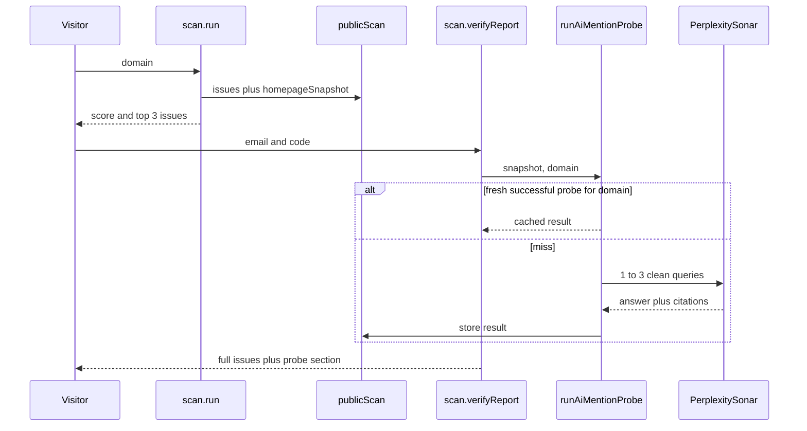

# Scanner S4: AI-mention probe

Implements [issue #53](https://github.com/opencited/opencited/issues/53) on top of the [PRD](https://github.com/opencited/opencited/issues/50). The probe runs only after `scan.verifyReport` succeeds. `scan.run` stays a technical scan and still completes with no LLM calls.

## Behavior

- **Queries** describe the category (“best issue tracker for software teams”), not the brand. Derive up to 3, then drop any that contain the brand name or domain. Run however many survive (1, 2, or 3). Return unavailable only when none are left.
- **Visible** when the answer text contains the brand as a word, or a citation host is the scanned domain (or a subdomain). Each row includes the query, a short excerpt, and up to 3 citation URLs.
- **Unavailable** when the key is missing, query derivation fails, Sonar errors, or the time budget is exceeded. The verified issue list and the report email still go out.
- **Cache:** a successful probe is reused for the same domain for 7 days. A failed probe is stored on that scan only, so reopening the report does not call the API again. A later scan of the same domain may try again.
- **Budget (hard cap per scan):** 1 query-derivation call (`maxOutputTokens: 200`, existing `createProvider()` model) and one Sonar call per surviving query, at most 3 (`sonar`, `maxOutputTokens: 350`). 12s per call, 25s overall. No further calls after the cap.

## Seams to test (TDD, one slice at a time)

These are the only new test seams:

1. [`extractHomepageSnapshot`](packages/scanner/src/checks/html.ts) — title, meta description, h1, JSON-LD / `og:site_name` brand, truncated visible text. Attached by [`runTechnicalScan`](packages/scanner/src/engine.ts) and **not** returned by `scan.run`.
2. `detectBrandMention` — known answer/citation fixtures → `visible` or `not-visible` plus excerpt.
3. `runAiMentionProbe` — injected deriver + answer engine + clock. Cache hit makes zero calls. Engine throw → `unavailable`. Fourth Sonar call is never made. Branded queries are discarded; one or two survivors are still run. Unavailable only when zero clean queries remain.
4. [`verifyReportAction`](packages/actions/src/scan/verifyReportAction.ts) — probe payload on the verified output; probe failure still returns every issue and still calls `sendFullReport`.

## Persistence

Add nullable columns on [`public_scan`](packages/db/src/schema/publicScan.ts):

- `homepage_snapshot` jsonb (capped text; written in [`runPublicScanAction`](packages/actions/src/scan/runPublicScanAction.ts))
- `ai_mention_probe` jsonb
- `probe_completed_at` timestamptz

Extend [`ScanRepository`](packages/actions/src/scan/scanRepository.ts) with `saveHomepageSnapshot` usage via insert, `saveAiMentionProbe`, and `findFreshProbe(domain, since)`. Generate a Drizzle migration with `bun run db:generate`.

## Answer engine

Add `@ai-sdk/perplexity` via the root `workspaces.catalog` (`catalog:`), and optional `PERPLEXITY_API_KEY` in [`packages/actions/src/env.ts`](packages/actions/src/env.ts), [`.env.example`](.env.example), and [`turbo.json`](turbo.json) `globalEnv`. Missing key → unavailable, not a thrown scan error. Production adapter reads `generateText` `text` and `sources`.

## Report surfaces

- Extend `verifyReportOutputSchema` with `probe: { status: "ok", queries: [...] } | { status: "unavailable" }`.
- After unlock, [`scan-result.tsx`](apps/web/app/components/scan/scan-result.tsx) shows an “AI answer visibility” section: `Badge` `success` for Visible, `outline` for Not visible, excerpt, citation links. Unavailable is one muted line. Update the gate copy so the locked card mentions this section.
- Include the same section in [`scan-full-report.tsx`](packages/transactional-email/emails/scan-full-report.tsx) and `ScanMailer.sendFullReport`.
- Add an **aiMentionProbe** glossary entry in [`CONTEXT.md`](CONTEXT.md).

## Close-out

Typecheck while iterating, run the touched `bun test` files each slice, then the full suite. Review the diff against issue #53. Commit on the current branch (the implement skill asks for this).
