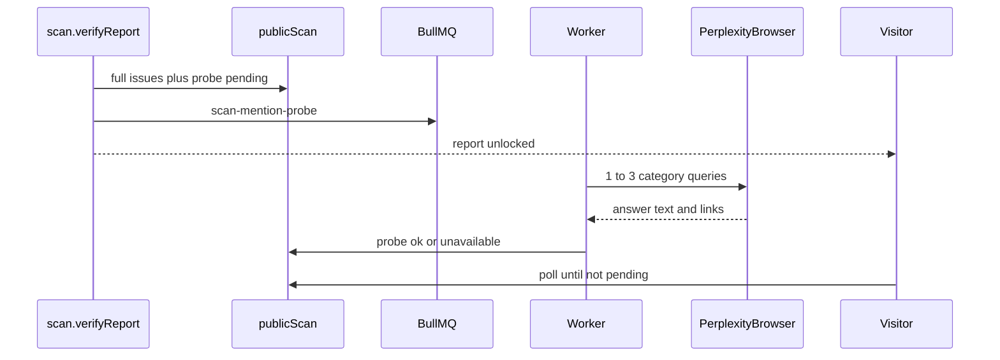

# Refactor S4 to Perplexity browser crawls

Updated [issue #53](https://github.com/opencited/opencited/issues/53): answers must come from the Perplexity web UI, the same `Crawler` + `PerplexityProvider` path the product uses. The Sonar API and a browser session return different answers, so `@ai-sdk/perplexity` goes away.

A single Perplexity crawl waits up to 60s for the answer to finish streaming ([`waitForResponse`](packages/browser-crawler/src/providers/perplexity.ts)). Three of those cannot run inside `scan.verifyReport` (the homepage request returned in ~6s). Verification stays fast. The probe runs on the worker.

## Remove the API adapter

Delete [`perplexityAnswerEngine.ts`](packages/actions/src/scan/aiMentionProbe/perplexityAnswerEngine.ts), drop `@ai-sdk/perplexity` from the catalog and [`packages/actions/package.json`](packages/actions/package.json), and remove `PERPLEXITY_API_KEY` from [`packages/actions/src/env.ts`](packages/actions/src/env.ts), [`.env.example`](.env.example), and [`turbo.json`](turbo.json). Query derivation stays on the existing Groq/OpenAI provider in [`deriveCategoryQueries.ts`](packages/actions/src/scan/aiMentionProbe/deriveCategoryQueries.ts). Brand detection stays in [`detectBrandMention.ts`](packages/actions/src/scan/aiMentionProbe/detectBrandMention.ts).

## Probe states

Extend `aiMentionProbeSchema` in [`packages/db/src/schema/publicScan.ts`](packages/db/src/schema/publicScan.ts) with `{ status: "pending" }`. No new columns. `findFreshProbeForDomain` still returns only `status: "ok"` rows newer than 7 days, so a failure is not reused and a later scan can try again.

## Verify does not open a browser

In [`verifyReportAction.ts`](packages/actions/src/scan/verifyReportAction.ts):

- Cached ok probe for the domain: copy it onto this scan and return it.
- This scan already has `probeCompletedAt`: return the stored probe (including a stored failure).
- Otherwise derive up to 3 category queries, drop any that contain the brand or domain, and keep 1–3 survivors.
- Zero clean queries, or derivation throws: store `{ status: "unavailable" }` and still send the report email.
- Otherwise store `{ status: "pending" }`, dispatch a new queue job, send the report email with the technical issues (probe section says the Perplexity check is still running), and return `pending`.

Inject the dispatcher in tests so verify never imports Camoufox.

## Worker job

Add `scan-mention-probe` to [`packages/queue/src/jobs.ts`](packages/queue/src/jobs.ts):

- Payload: `publicScanId`, `domain`, `brandName`, `queries` (1–3 strings).
- `attempts: 1`. Do not reuse `perplexity-crawl`; that job requires a `domainProject` and writes product crawl tables.

Register a handler in [`apps/worker`](apps/worker) that:

- Calls `new Crawler().crawl({ query, provider: createProvider("perplexity"), proxies })` once per query, sequentially.
- Uses the worker’s existing env proxy list ([`fetchProxyList`](apps/worker/src/lib/proxy-resolution.ts) / `THORDATA_PROXY_API_URL`), not a domainProject proxy.
- Hard cap: at most 3 crawls, and stop starting new ones after 3 minutes.
- Maps `CrawlResult.content` plus `structured.inlineLinks` and `structured.sourcePanelLinks` URLs through `detectBrandMention`.
- If at least one crawl returns an answer, store `{ status: "ok", queries: [...] }` for those answers. If every crawl throws, store `{ status: "unavailable" }`.
- Writes via `ScanRepository.updatePublicScanProbe`. A throw in the handler must still persist `unavailable` so the UI does not poll forever.

## UI

[`AiMentionProbeSection`](apps/web/app/components/scan/ai-mention-probe-section.tsx) treats `pending` as “Checking Perplexity…”. After unlock, [`scan-result.tsx`](apps/web/app/components/scan/scan-result.tsx) polls a new `scan.mentionProbe` query (`scanId` + email, only when that lead is verified) until status is `ok` or `unavailable`. Visible / Not visible badges stay as they are. The email copy for a still-pending probe says the live Perplexity check is running and the technical report is complete.

Update the **aiMentionProbe** glossary line in [`CONTEXT.md`](CONTEXT.md): browser crawl, not Sonar.

## Tests

- `verifyReportAction`: with an injected dispatcher, a clean query list stores `pending` and dispatches once; a thrown deriver still returns every issue and calls `sendFullReport`.
- Pure mapper from a fixture `CrawlResult` to a probe row (visible via citation domain, not-visible otherwise). No live browser in unit tests.
- Worker handler with an injected `crawl` function: one success + one throw stores `ok` with one row; all throws store `unavailable`.

## Local check

Redis, the worker (`bun run dev:worker`), and Camoufox (`bun run setup:browser-crawler`) must be up. Run a new scan after this ships; the previous `unavailable` row on the old `scanId` will not retry.
